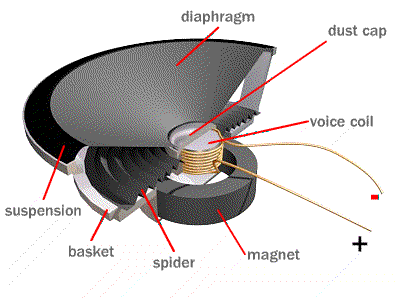
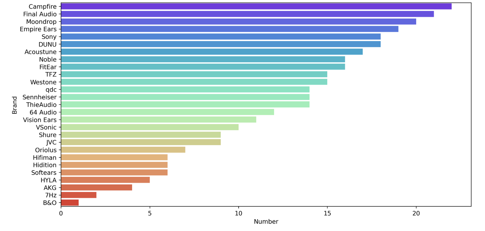
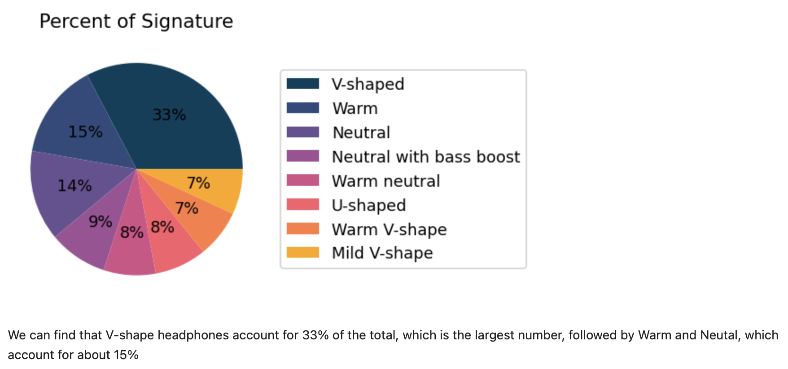

# Earphone Sound Quality and Rank  Analysis


## Introduction

This project focuses on analyzing the factors that contribute to sound quality and the rank in earphones. By examining different aspects such as driver types, earphone setups, brand presence, sound signatures, and price-performance relationships, this project aims to provide valuable insights for both consumers and manufacturers in the earphone industry.



## Dataset

This project data set is scrap from the HIFI Website of the earphoneranking by In-Ear Fidelity.

([https://crinacle.com/rankings/iems/](https://crinacle.com/rankings/iems/)).

## Requirements

```
selenium==3.141.0
pandas==1.3.3
seaborn==0.11.2
matplotlib==3.4.3
numpy==1.21.2
scikit-learn==0.24.2
```

Save the above requirements in a text file named `requirements.txt`. You can then install these dependencies using the following command:

```
pip install -r requirements.txt
```

Make sure you have a compatible version of Python installed on your system before running the above command.
## Result



## ****Questions I would like to answer in this project****

1. How are the prices of different earphones distributed?
2. Is there a correlation between headset price and ranking？
3. How about the proportion of different headphone features?
4. What is the number of earphones of different brands?
5. What setup is the best for earphones?
6. How to predict different setup parameters  to impact the sound of earphones?
7. What relationship between the number if units and the sound of earphones?
